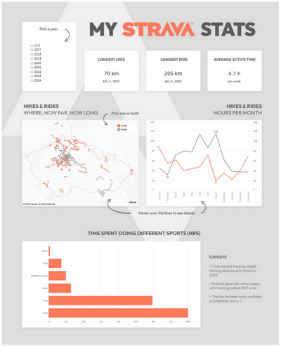

# Project

⚙ *pandas, gpxpy, figma, tableau*

An interactive Tableau viz based on my Strava app logs that shows my longest hike and bike ride, time spent doing different sports, and the map of all hikes and rides over the years. 

[See Viz on Tableau Public 🡢](https://public.tableau.com/app/profile/e.h1716/viz/MyStravaStats_17217433665740/DASH)
